# EasyAuthorize

* sign up/ sign in page for the citizen/ organization

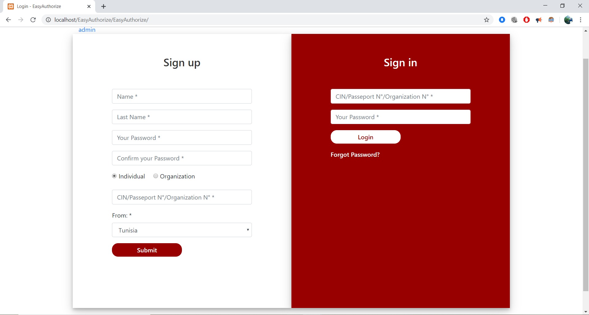
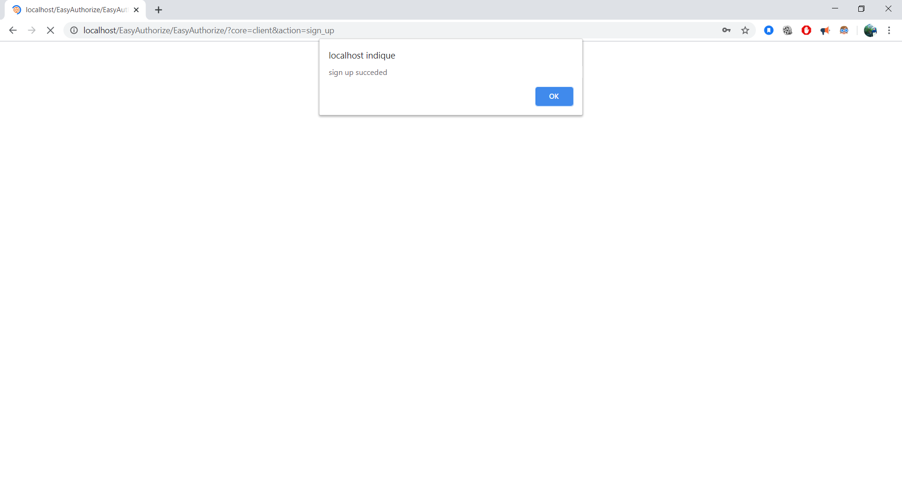

* Once signed in, the citizen fills the athorization form:
    - If he picks 'need for food' option, the authorizarion duration is limited to 2h max, he can get it only once per day
    - 'Need for food' and 'Emegency' options are approved automaticaly
    - If he chooses Other, he has to add a coment and wait for approval
    
 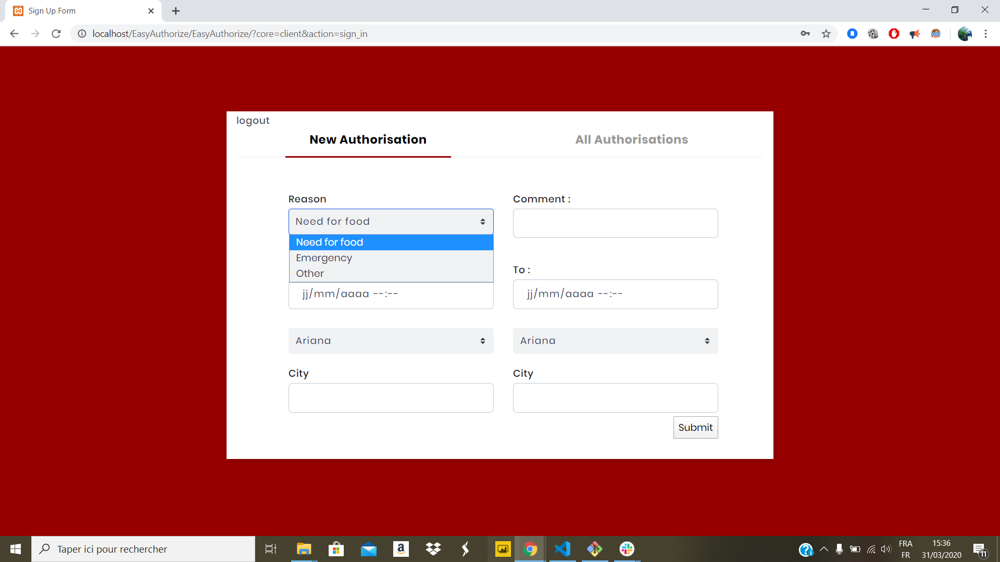  
    
    
* He can check his previous authorizations.

   
 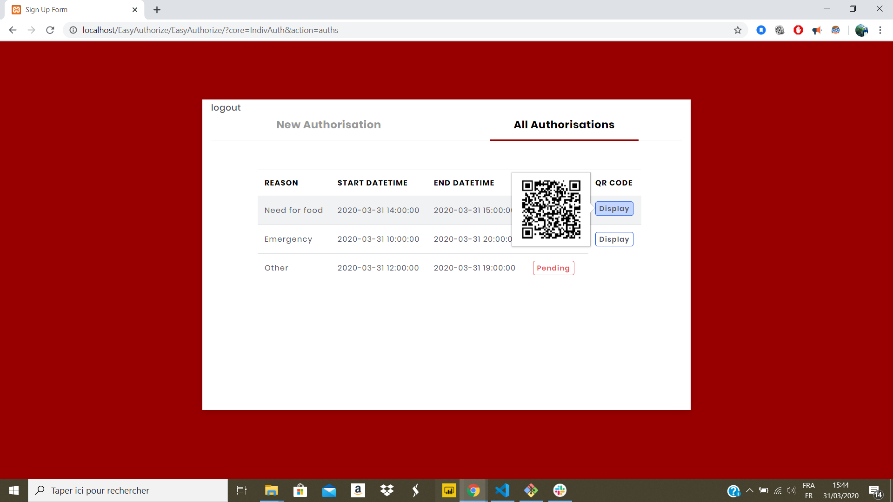  

* For Organization, it always needs an approval for its authorization request

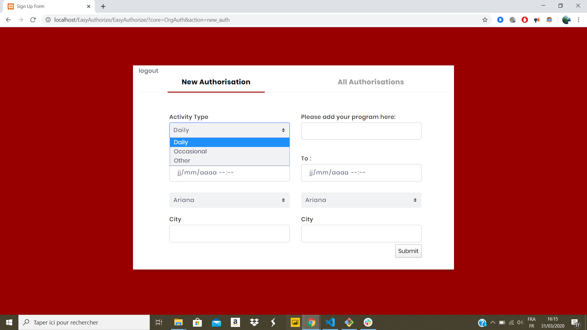  
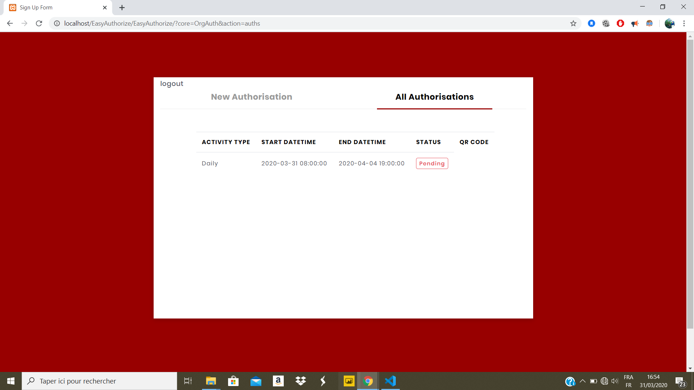  

------------------------------------------------------------------------------------------------------------------------

* sign up/ sign in page for the admin/ who's responsible for the approval

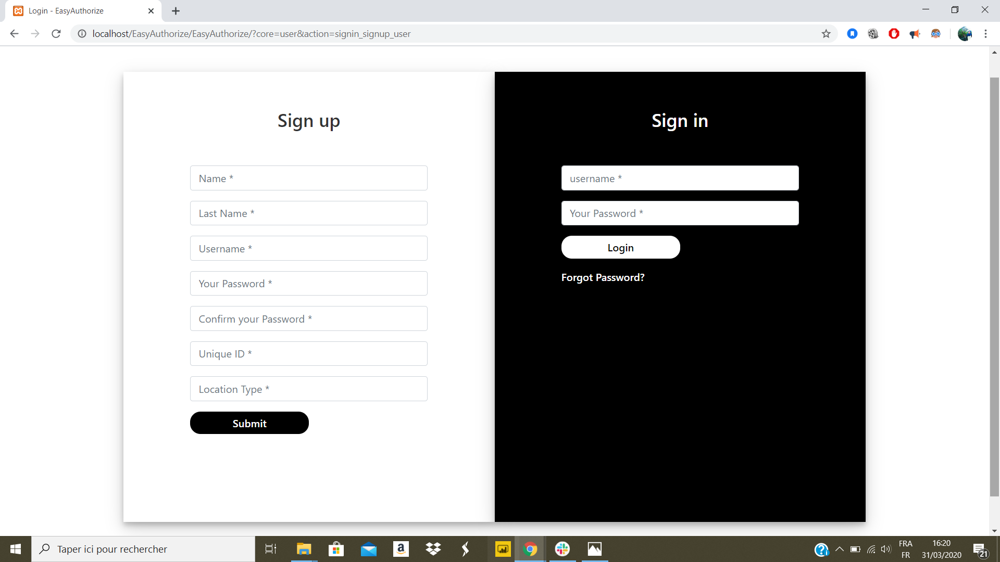  

* The approver can check the authorizations assigned to him (based on the location of the citizen/organization)

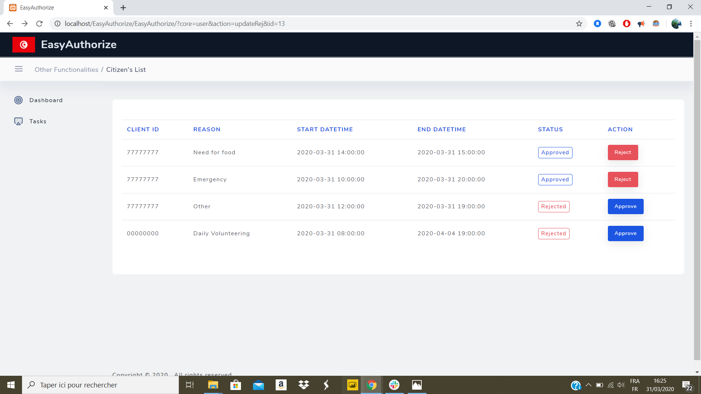 

* The approver can approve an authorization

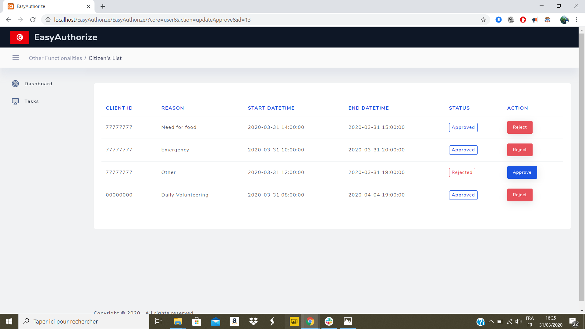 

* The approver can vizualize the authorizations in every state/city

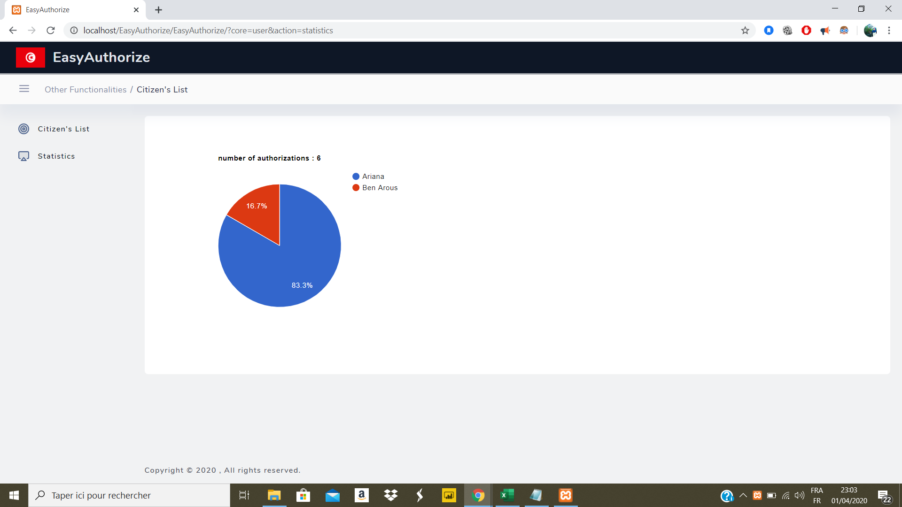 

* List of Authorizations after approval

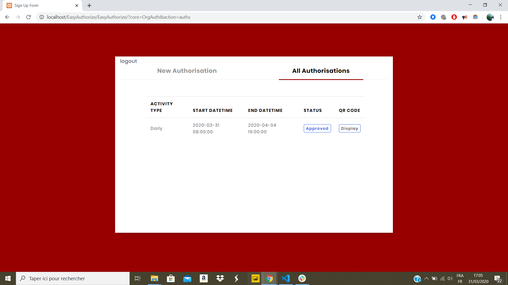 

------------------------------------------------------------------------------------------------------------------------

What's next?
- Adding a dashboard with KPIS for the approver to visualize the behavior of the circulation of citizens/organization.
- Developping a mobile version
